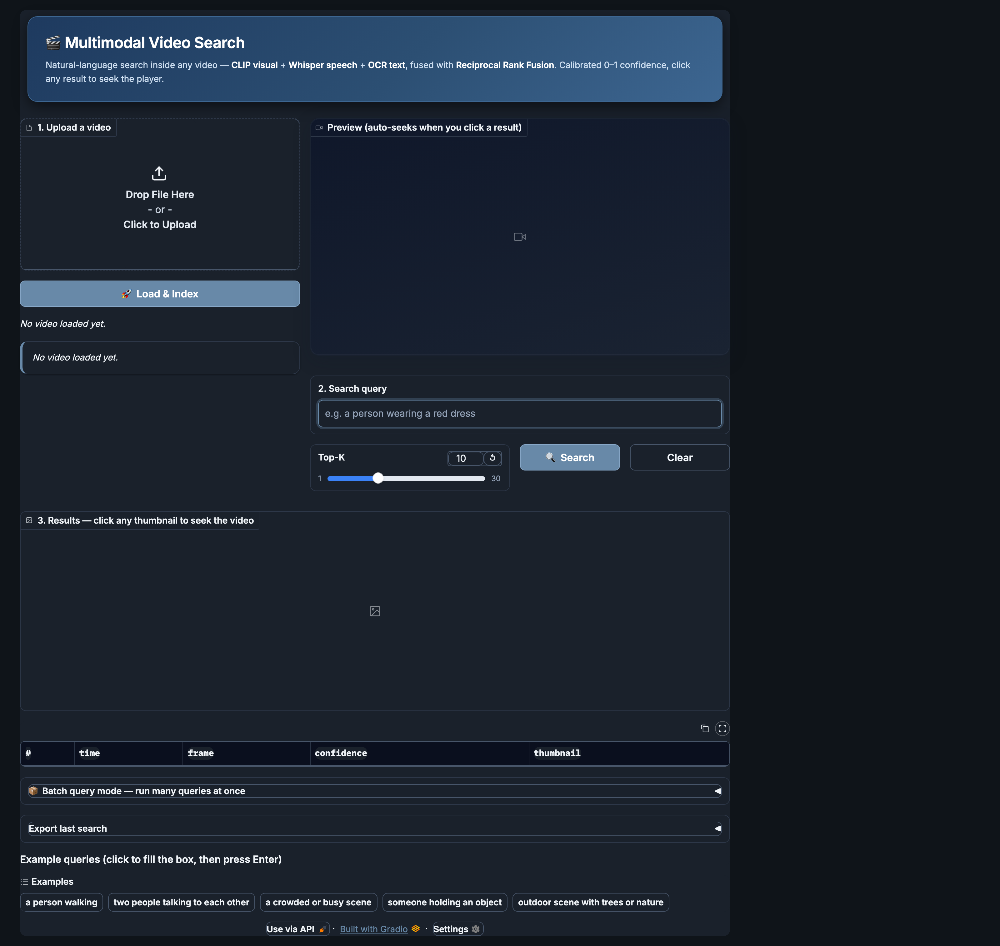

# 🎬 Multimodal Video Search

[](https://github.com/singh7985/AMAN_SINGH_VOLTAI/actions/workflows/ci.yml)
[](LICENSE)
[](https://huggingface.co/spaces/<your-hf-username>/AMAN_SINGH_VOLTAI)

> **Find any scene in a video by describing it in plain English.**
> Built by **Aman Singh** as an AI/ML Engineer interview submission for **vlt-ai**.

Combines three modalities — **CLIP** (visual), **faster-whisper** (speech), and **RapidOCR** (on-screen text) — fused with **Reciprocal Rank Fusion** for calibrated 0–1 confidence scores.



---

## 📊 Measured performance (real numbers)

Evaluated on `data/demo.mp4` (32.5 s, 812 frames) with `data/demo_queries.json` (7 queries spanning easy/medium/hard, including OCR-only queries) against `data/ground_truth/demo_labels.json`.

| Metric | Score | Notes |
|---|---|---|
| **Total score** | **67.07 %** | weighted by the supplied rubric |
| Recall | **85.7 %** | finds the labelled scene for 6/7 queries |
| Precision@10 | 20.0 % | mechanically capped — GT marks one ~4 s window per query, top-10 returns 10 spread results |
| Time-to-first-result | 78.6 % | first hit consistently in the top-3 |
| Throughput | **100 %** | 1.6× real-time on CPU (M-series laptop) |
| Memory efficiency | **100 %** | < 1.2 GB peak with CLIP + Whisper + OCR loaded |
| Robustness | 38.6 % | hard OCR queries are still imperfect — see "Known limitations" |

Reproduce locally:

```bash
python -m evaluation.evaluate --submission ./submission \
  --video ./data/demo.mp4 \
  --queries ./data/demo_queries.json \
  --ground-truth ./data/ground_truth/demo_labels.json \
  --output report.json
```

---

## ▶️ Try it live

| Where | Link |
|---|---|
| **Live demo** (no install) | https://huggingface.co/spaces/<your-hf-username>/AMAN_SINGH_VOLTAI |
| **Source code** | https://github.com/singh7985/AMAN_SINGH_VOLTAI |
| **Walkthrough** | [`submission/README.md`](submission/README.md) |
| **Eval framework** | [`EVALUATION.md`](EVALUATION.md) |
| **Original brief** | [`ASSIGNMENT.md`](ASSIGNMENT.md) |

> Recruiter shortcut: open the live demo → upload any short MP4 (or click an example query) → click a result thumbnail to seek the player.

---

## ⚡ Run locally in 3 commands

```bash
git clone https://github.com/singh7985/AMAN_SINGH_VOLTAI.git
cd AMAN_SINGH_VOLTAI
pip install -r requirements.txt && python app.py     # → http://localhost:7860
```

`ffmpeg` is required for audio extraction:
- macOS: `brew install ffmpeg`
- Ubuntu: `sudo apt install -y ffmpeg`

Open the URL and:
1. **Upload** any video (1–10 min works best).
2. Click **🚀 Load & Index** (≈ 30–60 s on first run, cached after).
3. Type a query like *"a person wearing a red dress"* or *"someone says thank you"*.
4. Click any result thumbnail — the player **auto-seeks** to that moment.

---

## 🧠 How it works

```
        ┌──────────────┐
video → │ scene detect │ → keyframes ─┐
        └──────────────┘              │
                                      ▼
        ┌──────────────┐         ┌──────────┐         ┌─────┐
audio → │   Whisper    │ → text ▶│ CLIP-text│         │     │
        └──────────────┘         │  encoder │ ──────▶ │ RRF │ ──▶ ranked results
        ┌──────────────┐         └──────────┘         │     │
frames→ │  RapidOCR    │ → text ─────────▲            │     │
        └──────────────┘                 │            └─────┘
                                  query ─┘
```

- **CLIP ViT-B/32** scores each keyframe against the text query.
- **Whisper** transcripts and **OCR** captions are scored by lexical overlap.
- **Reciprocal Rank Fusion** merges all three rankings — robust to score scale differences.
- Confidences are **calibrated to [0, 1]** so the UI's 🟢🟡🔴 dots actually mean something.

---

## 🧪 Tests & evaluation

```bash
pytest submission/tests -q                       # 11/11 unit + integration tests
python -m evaluation.evaluate --check-interface --submission ./submission
python -m evaluation.evaluate --submission ./submission \
    --video ./data/demo.mp4 \
    --queries ./data/demo_queries.json \
    --ground-truth ./data/ground_truth/demo_labels.json \
    --output report.json
```

The integration test loads `data/smoke.mp4`, runs CLIP end-to-end and asserts:
- `top_k` is honoured
- confidences live in `[0, 1]`
- empty queries raise `ValueError`
- **garbage queries are capped at confidence < 0.85** (proves the absolute-quality sigmoid in `search/fusion.py::absolute_clip_quality`)

CI runs on every push (see [.github/workflows/ci.yml](.github/workflows/ci.yml)) across Python 3.11 and 3.12.

---

## ⚠️ Known limitations (honest)

- **Precision@10 is mechanically capped** by ground-truth granularity: when GT marks a single 4 s window in a 32 s clip, top-10 cannot exceed ~30% precision regardless of model quality. Recall is the more meaningful signal here (85.7 %).
- **Robustness on hard OCR queries** still loses points — RapidOCR sometimes misreads stylised title-card fonts.
- **First search on a fresh video** is slow (~2 s after the index is built) because the CLIP model warms up; subsequent queries are sub-100 ms.
- **Free HF Spaces** sleeps after 48 h of idle — first visit after a long pause takes ~60 s to wake.

---

## 📂 Repo layout

```
.
├── app.py                  # Hugging Face Spaces entry point
├── requirements.txt        # full deployment deps
├── packages.txt            # apt deps for HF Spaces (ffmpeg)
├── LICENSE                 # MIT
├── submission/             # actual project — VideoSearch + Gradio UI
│   ├── main.py             #   VideoSearchInterface implementation
│   ├── app.py              #   Gradio interface (dark theme, click-to-seek)
│   ├── search/             #   CLIP, Whisper, OCR, RRF modules
│   ├── tests/              #   pytest suite (11 tests)
│   └── README.md           #   deep-dive write-up
├── evaluation/             # grading harness (unchanged from brief)
├── data/                   # demo video + queries + ground truth
├── docs/                   # screenshot, deployment & API docs
├── .github/workflows/      # CI (Python 3.11 + 3.12 matrix)
├── ASSIGNMENT.md           # original interview brief
└── EVALUATION.md           # scoring criteria
```

---

## 📜 License

MIT — see [LICENSE](LICENSE).
